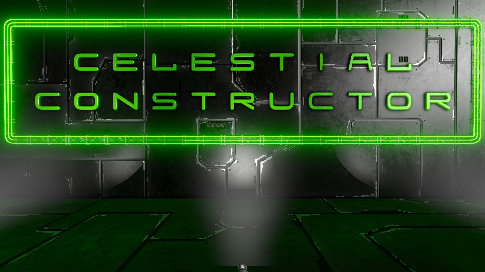

Celestial Constructor is a mod for Space Engineers that is the spiritual successor to the amazing Nanobot and Repair System, but designed for high performance servers. It will also work in local worlds. This is a completely new mod that does not rely on any previous assets outside of official game files. While adding or considering new features, everything will be executed with high performance in mind, even if it sacrifices some niceties.

## Finished:

## In Development:
+ Projector Placer
+ Welder
+ Grinder

## Potential Future Goals:
+ Drill and Fill inspired functionality
+ energy and O2/H2 refilling